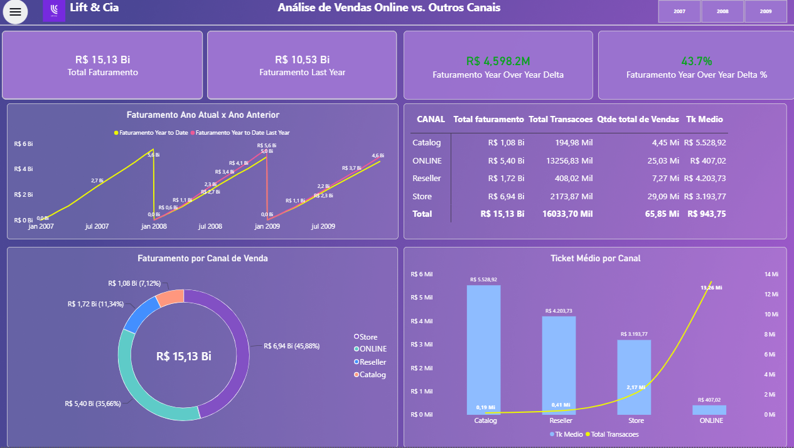

# Análise de Vendas Online vs. Outros Canais — Lift & Cia

## Visão Geral do Projeto
Este projeto tem como objetivo avaliar o desempenho dos canais de vendas da empresa **Lift & Cia** utilizando o banco de dados **ContosoRetailDW**, respondendo à provocação estratégica central: **"Devemos ou não investir mais no canal digital?"**.

A solução foi desenvolvida combinando extração e agregação de dados via **SQL (SQL Server)**, modelagem relacional de dados com tabela calendário personalizada, fórmulas em **DAX** para inteligência de tempo (YoY) e a construção de um **Dashboard Executivo interativo no Power BI**.

---

## 🖼️ Preview do Dashboard



---

## Estrutura e Tratamento dos Dados (SQL)
A consulta SQL foi elaborada para consolidar as transações do canal online (`FactOnlineSales`) e dos demais canais físicos/tradicionais (`FactSales` integrando com `DimChannel`).

### Métrica de Consolidação:
* **`DateKey`**: Chave temporal para relacionamento com a tabela fato/calendário.
* **`TOTAL_TRANSACOES`**: Contagem total do número de registros (`COUNT(*)`).
* **`QTDE_DE_VENDAS`**: Soma da quantidade total de itens vendidos (`SUM(SalesQuantity)`).
* **`TOTAL_FATURAMENTO`**: Soma do valor total faturado (`SUM(SalesAmount)`).
* **`TICKET_MEDIO`**: Média do valor faturado por transação (`AVG(SalesAmount)`).

```sql
USE ContosoRetailDW;

SELECT 
    DateKey
    ,COUNT(*) AS TOTAL_TRANSACOES
    ,SUM(SalesQuantity) AS QTDE_DE_VENDAS
    ,SUM(SalesAmount) AS TOTAL_FATURAMENTO
    ,AVG(SalesAmount) AS TICKET_MEDIO
    ,'ONLINE' AS CANAL_DE_VENDA
FROM FactOnlineSales AS ONLINE
GROUP BY DateKey

UNION ALL

SELECT 
    F.DateKey
    ,COUNT(*) AS TOTAL_TRANSACOES
    ,SUM(F.SalesQuantity) AS QTDE_DE_VENDAS
    ,SUM(F.SalesAmount) AS TOTAL_FATURAMENTO
    ,AVG(F.SalesAmount) AS TICKET_MEDIO
    ,C.ChannelName AS CANAL_DE_VENDA
FROM FactSales AS F
INNER JOIN DimChannel AS C ON C.ChannelKey = F.ChannelKey
GROUP BY F.DateKey, C.ChannelName
ORDER BY CANAL_DE_VENDA;

## Principais Insights e Descobertas

1. **Volume de Transações vs. Ticket Médio:**
   * O canal **ONLINE** é o líder disparado em volume de pedidos, registrando **5.198,93 Mil transações** e **39,34% do Faturamento** (R$ 1,81 Bi).
   * No entanto, o **Ticket Médio do canal ONLINE é de apenas R$ 347,93**, sendo drasticamente menor do que os canais tradicionais:
     * **Catalog:** R$ 5.338,85
     * **Reseller:** R$ 4.533,21
     * **Store:** R$ 3.800,74

2. **Evolução Temporal e Retração YoY:**
   * No acumulado *Year-to-Date*, a empresa apresenta uma queda de **-7,3% no Faturamento** (-R$ 363 Milhões em relação ao ano anterior - *Last Year*).
   * O gráfico de evolução mostra que a aceleração do volume digital não foi suficiente para sustentar o crescimento de faturamento da empresa devido ao baixo ticket médio unitário.

---

## Conclusão Estratégica

### **Pergunta Central:** *Devemos ou não investir mais no canal digital?*

**Resposta:** **SIM, a empresa deve continuar investindo no digital levando em consideração ao crescimento no volume de vendas, porém reorientando completamente a sua estratégia comercial e de marketing com o objetivo central de aumentar o ticket médio do canal.**

---

## Tecnologias e Ferramentas Utilizadas

* **SQL:** Agregação complexa, união de fatos com `UNION ALL` e junção com dimensão via `INNER JOIN`.
* **Power BI:** Modelagem dimensional (`dim_calendario`), criação de medidas DAX para Inteligência de Tempo e visualização de dados executivo.
